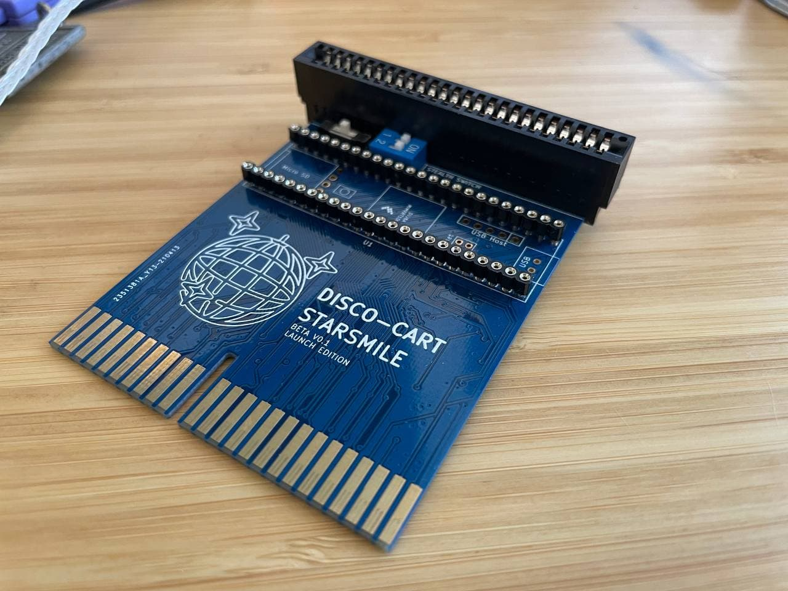
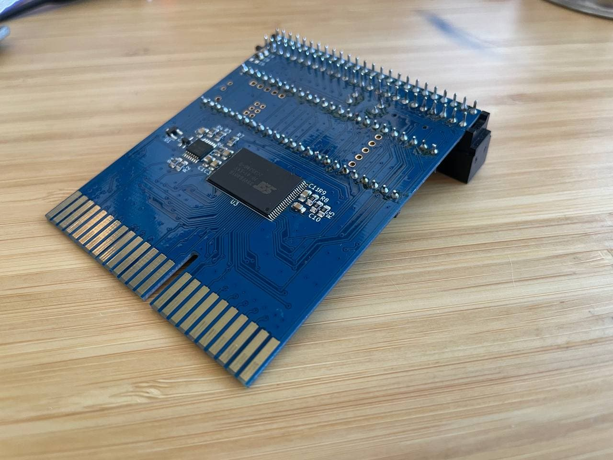
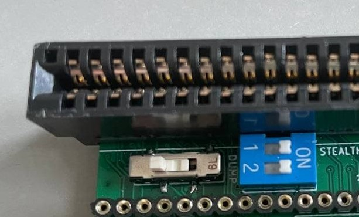

# V.Smile Disco-Cart
Custom developer cartridge that easily enables the following
- Ability to dump retail cartridges over Serial or to an SD card
- Ability to flash roms over serial or an SD card to built in flash memory
- Booting cartridge on real V.Smile hardware
- Use Teensy to fuzz data + address bus while system is online (WIP)
- "Stealth" switch to disable sense pinout to allow console to boot as if Cartridge was not inserted

## Contents

- [Cartridge](#cartridge)
- [Usage](#usage)
- [Examples](#examples)
    + [Read retail cartridge to local file over serial](#read-retail-cartridge-to-local-file-over-serial)
    + [Dump retail cartridge to SD card](#dump-retail-cartridge-to-sd-card)
    + [Flash local rom to flashcart](#flash-local-rom-to-flashcart)
- [Args](#args)
    + [`port`](#-port-)
    + [`out`](#-out-)
    + [`limit`](#-limit-)
    + [`bank`](#-bank-)
    + [`mode`](#-mode-)
    + [`name`](#-name-)
    + [`length`](#-length-)
- [Contributing](#contributing)

## Cartridge




## Usage

1. Install [PlatformIO](https://platformio.org/) onto your local system.
2. Install latest LTS for [NodeJS](https://nodejs.org/en/) onto your local system.
3. Install supporting packages for serial management script: 
```shell
cd ./manager
yarn
```
4. Use PlatformIO to pull in required packages, build, and then deploy firmware onto your Teensy (optionally, flash [`firmware.hex`](https://github.com/DiscoStarslayer/vsmile-dumper/releases/download/v0.1/firmware.hex))
5. Socket Teensy into Disco-Cart, ensure USB port on teensy lines up with the USB silkscreen on the board
6. Move mode select switch to the desired position

- `Left`: Cart mode, to insert into a V-Smile and boot a flashed rom
- `Middle`: Flash mode, select this mode to read/write to the internal flash on the Disco-Cart
- `Right`: Dump mode, select this mode to read/write from an inserted retail cartridge
7. Use manager scripts to perform your desired action

## Examples

### Read retail cartridge to local file over serial

```shell
# Switch: Dump mode
node .\index.js --port=COM3 --out=./thomas.bin --limit=3FFFFF --bank=LOW
```

### Dump retail cartridge to SD card

```shell
# Switch: Dump mode
node .\index.js --port=COM3 --mode=sddump --name=thomas.bin --length=3FFFFF
```

### Flash local rom to flashcart

```shell
# Switch: Write mode
node .\index.js --port=COM3 --mode=write --rom=./thomas.bin
```

### Inserting into a V.Smile
Ensure mode select switch is in Cart mode. Teensy can remain inserted in cartridge while in this mode. If you wish to write a new flash, you can do so while the cartridge is inserted by first switching mode to Write mode and running the write action from the manager

## Args

### `port`

Determines the serial port to connect to, defaults to `COM3`


### `out`

Relative file path to write the rom dump to, defaults to `./dump.bin`

### `limit`

Max address to dump to in hex. Banked cartridges generally have a 4MB and 2MB flash, so they need a limit of `1FFFFF` and `FFFFF` respectively. A single 8MB flash should accept `3FFFFF`.

### `bank`

If cartridge is banked, select which bank to dump. Defaults to `LOW`, non-banked cartridges should be set to `LOW`.

### `mode`

Which mode to operate the teensy in. Accepts `dump`, `write` and `sddump`.

### `name`

When writing to SD card, the file name to write to

### `length`

When writing to SD card, the size of the file to be written, in hex.

## Contributing

Project is fully open source under GPL3, including hardware design.
- `cartridge`: Hardware design as a KiCad Project
- `manager`: JS Script to aid with interfacing the Teensy over serial
- `src`: C++ Platform IO source for Teensy 4.1