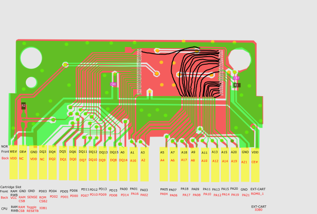

# V-Smile Cartridge Dumping Tool (WIP)

Simple tool for Teensy 4.0 and Teensy 4.1's that allow you to dump the cartridge data of a V-Smile cartridge.

## Usage
Deploy Arduino project to Teensy using PlatformIO.

Install supporting packages for the serial management script:
```shell
cd ./manager
yarn
```

Connect deployed teensy program to your computer over serial, and run the script with parameters based off your cartridge:
```shell
 node .\index.js --port=COM3 --out=./alphapark1.bin --limit=1FFFFF --bank=LOW
```

### Args

#### `port`
Determines the serial port to connect to, defaults to `COM3`

#### `out`
Relative file path to write the rom dump to, defaults to `./dump.bin`

#### `limit`
Max address to dump to. Banked cartridges generally have a 4MB and 2MB flash, so they need a limit of `0x1FFFFF` and `0x0FFFFF` respectively. A single 8MB flash should accept `0x3FFFFF`.

#### `bank`
If cartridge is banked, select which bank to dump. Defaults to `LOW`, non-banked cartridges should be set to `LOW`.

### Wiring
Teensy should be wired like the following rough diagram:


Address lines 0 -> 20 should be wired to GPIO 0 -> 20. Data lines 0 -> 15 should be wired to GPIO 21 -> 36. CE# to GPIO 37, and CSB2 to GPIO 38. Address line 21 is not mapped in the codebase as I have not tested it yet.
